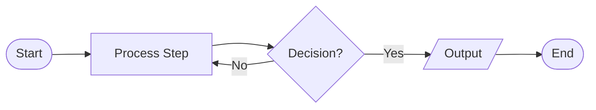
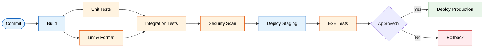
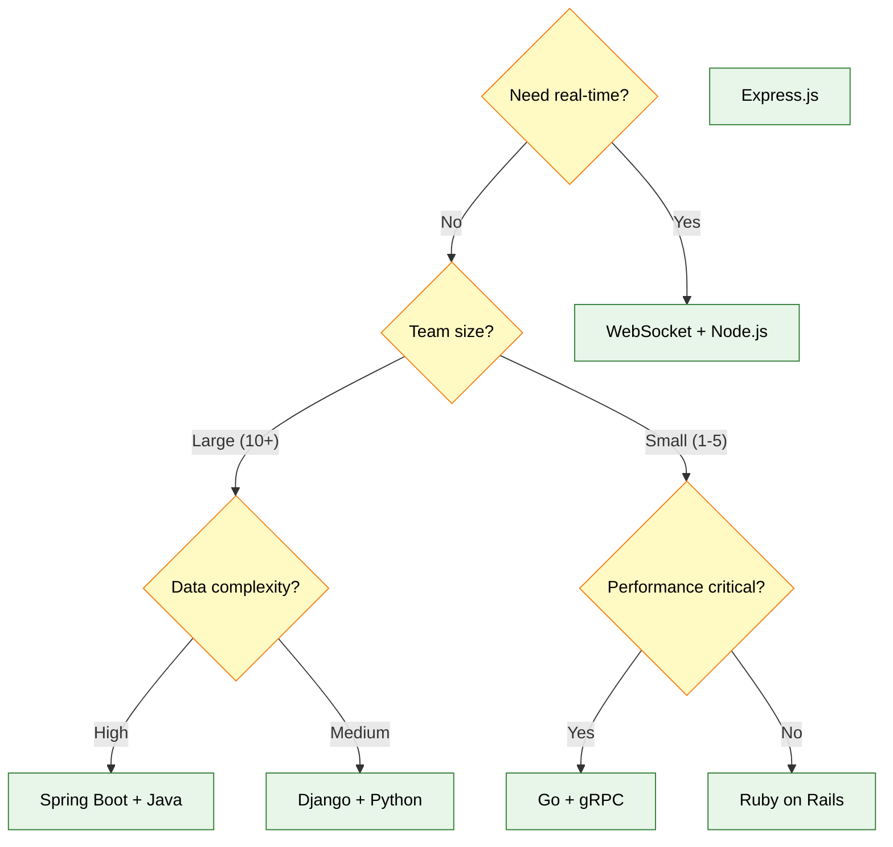
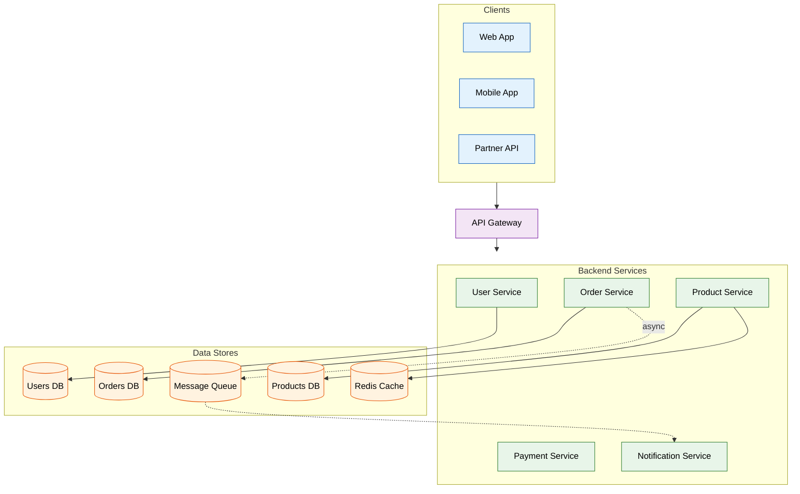
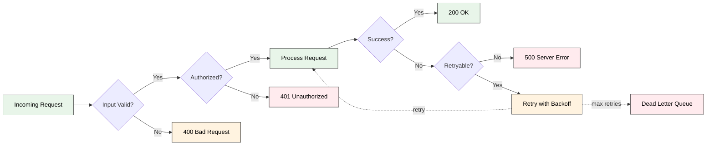
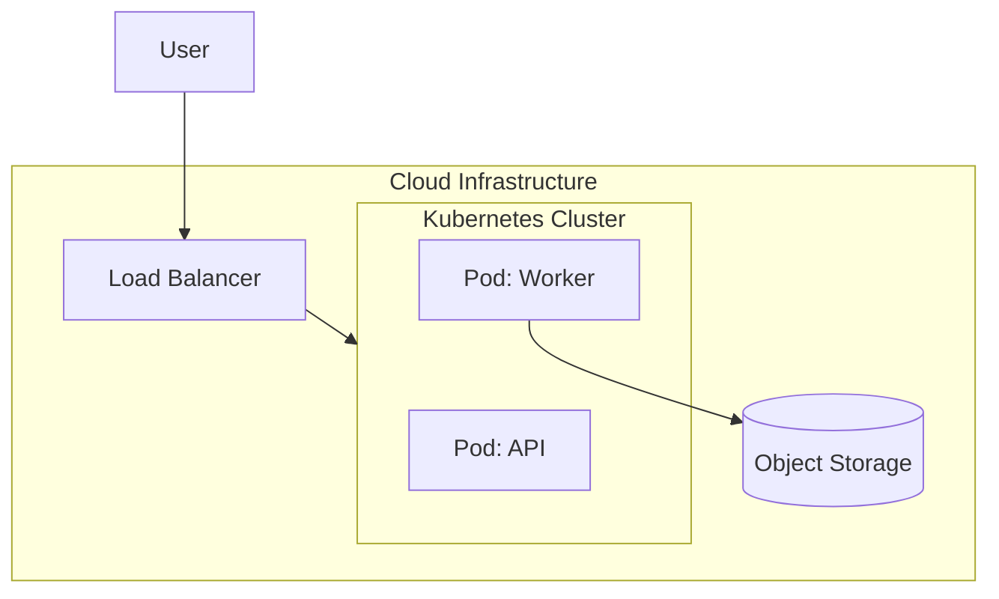

# Flowchart Diagrams — Complete Reference

## Table of Contents
1. [Anatomy of a Flowchart](#anatomy)
2. [Complete Examples](#complete-examples)
3. [Subgraph Techniques](#subgraph-techniques)
4. [Layout Control](#layout-control)
5. [Common Pitfalls](#common-pitfalls)

---

## Anatomy

Every flowchart has: a type declaration with direction, node definitions, edge connections,
and optional subgraphs and styling. Use `flowchart` (not `graph`) to access all modern features.



---

## Complete Examples

### Example 1: CI/CD Pipeline (LR — sequential process)



### Example 2: Decision Tree (TD — hierarchical)



### Example 3: Microservice Architecture (TB with subgraphs)



### Example 4: Error Handling Flow



---

## Subgraph Techniques

### Nested subgraphs for layered architectures



### Subgraph direction caveat

When a node inside a subgraph connects to a node outside, the subgraph's direction override is
**silently ignored**. Design your connections to avoid this, or accept the parent direction.

### Invisible subgraphs for grouping without visible borders

```
subgraph invisible[" "]
  style invisible fill:none,stroke:none
  A --> B
end
```

---

## Layout Control

### Invisible links for adjacent placement

Force two nodes to appear near each other without a visible connection:

```
A ~~~ B
```

### Extended links for spacing

Extra dashes add ranks of separation:

```
A ----> B      %% spans 2 extra ranks
A ------> C    %% spans 4 extra ranks
```

### Parallel edges with `&` operator

Send one node to multiple targets in a single line:

```
A --> B & C & D
```

Or create multiple parallel connections:

```
A & B --> C & D
```

This creates 4 edges: A→C, A→D, B→C, B→D.

---

## Common Pitfalls

### Pitfall 1: Subgraph with node named `end`

```
%% ❌ Subgraph never closes properly
subgraph section
  end --> start
end

%% ✅ Fixed
subgraph section
  endNode["end"] --> startNode
end
```

### Pitfall 2: Nodes starting with `o` or `x` after edge syntax

```
%% ❌ Parsed as circle/cross edge, not a node
A---oNode
A---xNode

%% ✅ Add space or quote
A--- oNode
A --> xNode[Exit Node]
```

### Pitfall 3: Redefining node labels

```
%% ❌ Second definition silently wins
A[First Label]
A --> B
A[Second Label]   %% "Second Label" is displayed

%% ✅ Define once, reference by ID
A[First Label]
A --> B
```

### Pitfall 4: Missing edge labels on decisions

```
%% ❌ Unlabeled decision branches
check{Valid?}
check --> process
check --> error

%% ✅ Always label decision outputs
check{Valid?}
check -->|"Yes"| process
check -->|"No"| error
```
