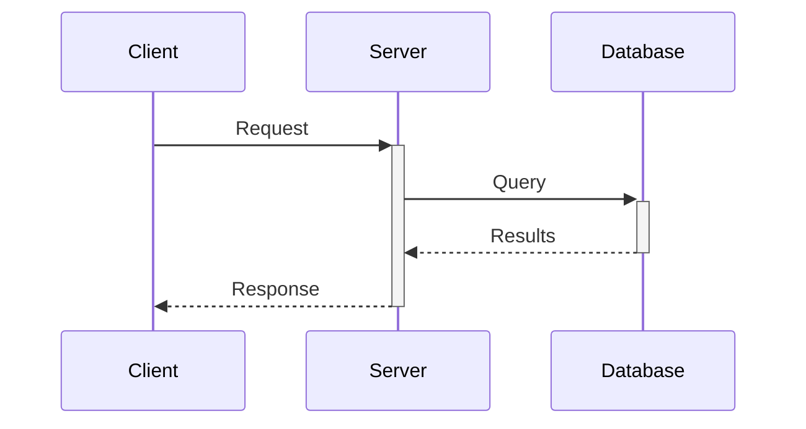
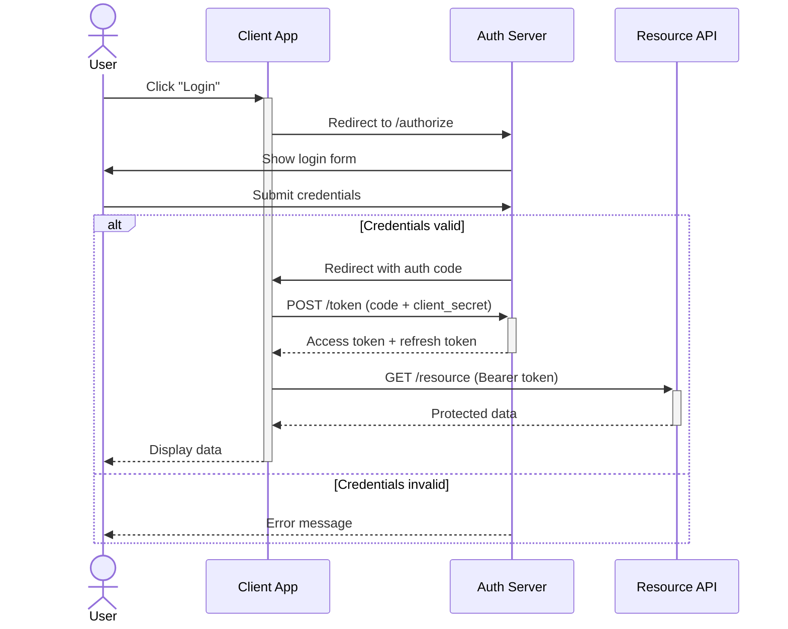
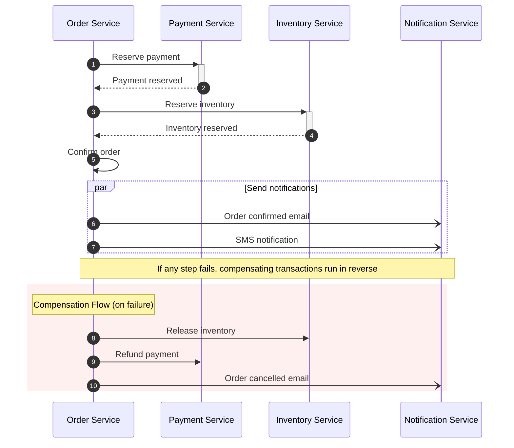
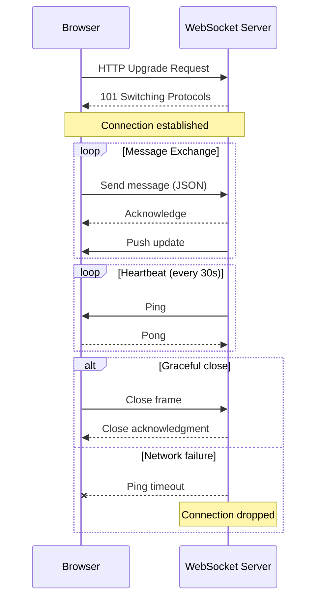

# Sequence Diagrams — Complete Reference

## Table of Contents
1. [Anatomy of a Sequence Diagram](#anatomy)
2. [Message Types](#message-types)
3. [Complete Examples](#complete-examples)
4. [Control Flow Blocks](#control-flow-blocks)
5. [Advanced Techniques](#advanced-techniques)
6. [Common Pitfalls](#common-pitfalls)

---

## Anatomy

Sequence diagrams show interactions between actors/participants ordered over time (top to bottom).
Always declare participants explicitly to control left-to-right ordering.



---

## Message Types

| Arrow | Syntax | Meaning |
|-------|--------|---------|
| Solid line, solid arrowhead | `->>` | Synchronous request |
| Dotted line, solid arrowhead | `-->>` | Synchronous response |
| Solid line, open arrowhead | `-)` | Asynchronous message (fire & forget) |
| Dotted line, open arrowhead | `--)` | Async response |
| Solid with cross | `-x` | Failed/lost message |
| Dotted with cross | `--x` | Failed response |

### Activation (processing duration)

Use `+` and `-` suffixes on arrows for clean activation bars:
- `C->>+S: Request` — activates S
- `S-->>-C: Response` — deactivates S

This is cleaner than separate `activate`/`deactivate` statements.

---

## Complete Examples

### Example 1: OAuth 2.0 Authorization Code Flow



### Example 2: Microservice Saga Pattern



### Example 3: WebSocket Connection Lifecycle



### Example 4: REST API with Retry Logic

```mermaid
sequenceDiagram
  accTitle: API Call with Retry
  accDescr: Shows exponential backoff retry pattern for transient failures

  participant Client
  participant LB as Load Balancer
  participant API as API Server
  participant DB as Database

  Client->>+LB: GET /users/123
  LB->>+API: Forward request

  API->>+DB: SELECT * FROM users WHERE id=123
  DB-->>-API: User record

  alt Success
    API-->>LB: 200 OK + JSON
    LB-->>Client: 200 OK + JSON
  else Transient error (503)
    API-->>LB: 503 Service Unavailable
    LB-->>Client: 503
    Note over Client: Wait 1s (attempt 1)
    Client->>LB: Retry GET /users/123
    LB->>API: Forward retry
    API-->>LB: 200 OK
    LB-->>-Client: 200 OK
  end
  deactivate LB
```

---

## Control Flow Blocks

### alt / else — Conditional branches

```
alt Condition A
  A->>B: Do something
else Condition B
  A->>C: Do something else
else Default
  A->>D: Fallback
end
```

### opt — Optional execution

```
opt User is premium
  S->>S: Apply discount
end
```

### loop — Repeated execution

```
loop Every 5 minutes
  Monitor->>Server: Health check
  Server-->>Monitor: Status OK
end
```

### par / and — Parallel execution

```
par Task 1
  A->>B: Do X
and Task 2
  A->>C: Do Y
and Task 3
  A->>D: Do Z
end
```

### critical / option — Critical region with fallbacks

```
critical Establish connection
  Service->>DB: Connect
option Network timeout
  Service->>Service: Use cached data
option Connection refused
  Service->>Service: Return error
end
```

### break — Exit the enclosing block

```
break When data is not found
  S-->>C: 404 Not Found
end
```

### rect — Background highlighting

```
rect rgb(230, 245, 255)
  Note over A,B: Secure zone
  A->>B: Encrypted message
end
```

---

## Advanced Techniques

### Participant grouping with `box`

```
box "Backend Cluster" rgb(230, 245, 255)
  participant API
  participant Worker
  participant Cache
end
```

### Notes positioning

```
Note left of A: Left note
Note right of B: Right note
Note over A,B: Spanning note
```

### Auto-numbering for complex flows

```
sequenceDiagram
  autonumber
  A->>B: First (1)
  B->>C: Second (2)
  C-->>A: Third (3)
```

### Participant aliases for readability

```
participant FE as "Frontend (React)"
participant BE as "Backend (Spring Boot)"
participant DB as "PostgreSQL 16"
```

---

## Common Pitfalls

### Pitfall 1: Too many participants

More than 7–8 participants makes the diagram unreadable. Split into focused diagrams showing
different aspects of the interaction.

### Pitfall 2: Deeply nested control flow

More than 2–3 levels of nesting (alt inside loop inside par) becomes very hard to read.
Flatten by extracting inner flows into separate diagrams.

### Pitfall 3: Unbalanced activation

Every `+` needs a matching `-`. Unbalanced activations cause visual glitches:

```
%% ❌ Activation never deactivated
A->>+B: Request
B-->>A: Response (missing -)

%% ✅ Properly balanced
A->>+B: Request
B-->>-A: Response
```

### Pitfall 4: Missing actor/participant declaration

Without explicit declaration, participant order depends on first appearance in the code,
which may not match the desired left-to-right visual order. Always declare explicitly.

### Pitfall 5: Colons in participant names

```
%% ❌ Colon breaks parsing
participant DB: PostgreSQL

%% ✅ Use alias syntax
participant DB as "DB: PostgreSQL"
```
