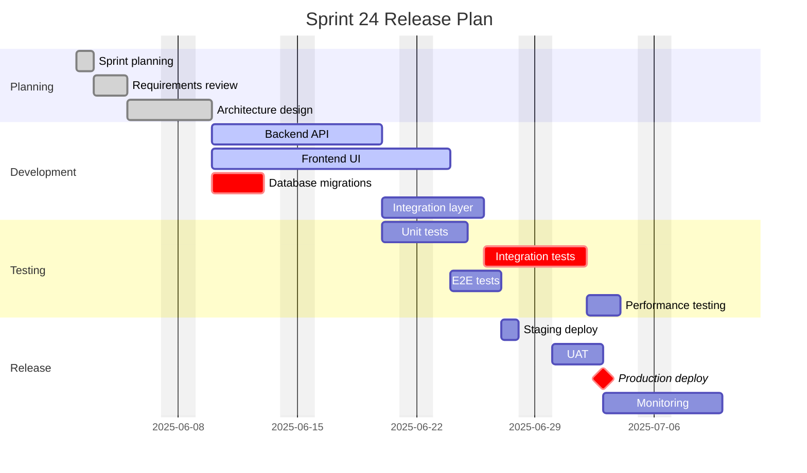
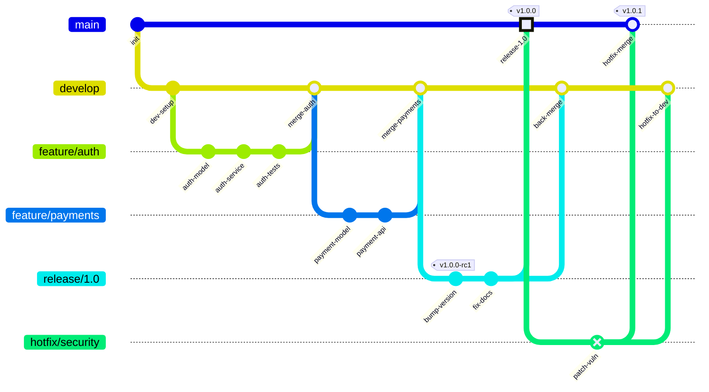
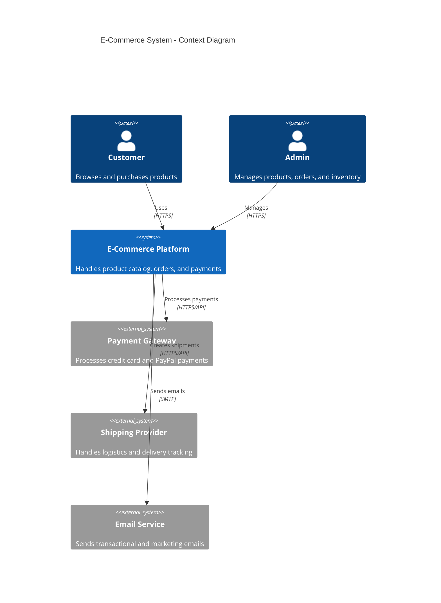
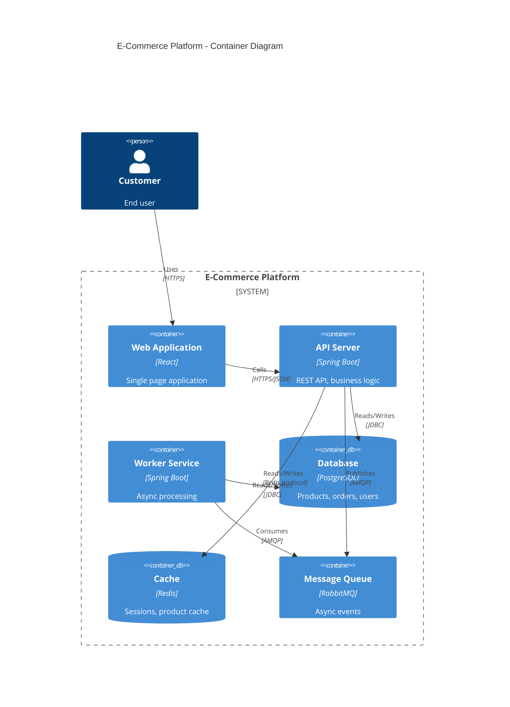
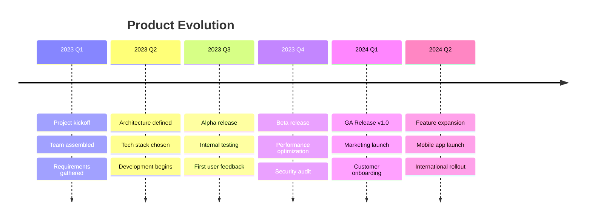
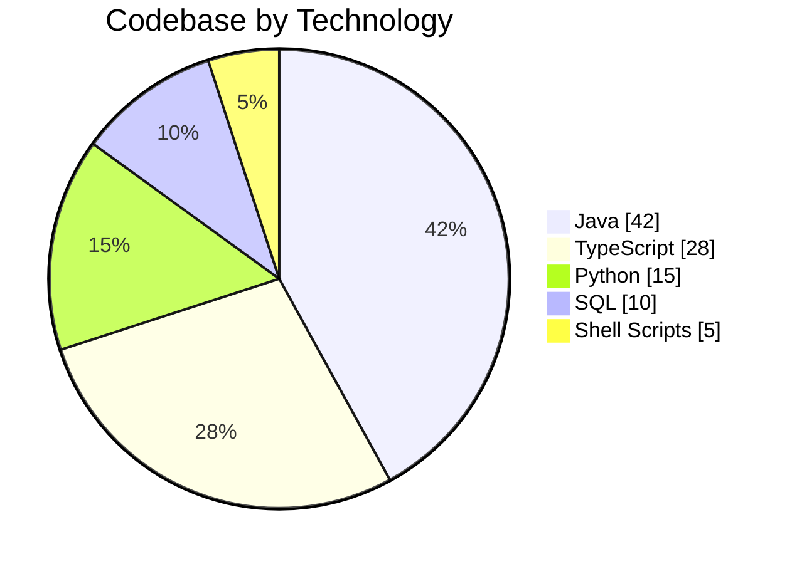

# Specialized Diagrams — Gantt, Git, C4, Mindmap, Timeline, Pie & Block

## Table of Contents
1. [Gantt Charts](#gantt-charts)
2. [Git Graphs](#git-graphs)
3. [C4 Diagrams](#c4-diagrams)
4. [Mindmaps](#mindmaps)
5. [Timeline Diagrams](#timeline-diagrams)
6. [Pie Charts](#pie-charts)
7. [Block Diagrams](#block-diagrams)

---

## Gantt Charts

### Anatomy

Gantt charts visualize project schedules with tasks, durations, dependencies, and milestones.
Always specify `dateFormat` and group tasks into `section` blocks.

### Task status keywords

| Keyword | Effect |
|---------|--------|
| `done` | Task completed (grayed out) |
| `active` | Currently in progress (highlighted) |
| `crit` | Critical path (red) |
| `milestone` | Zero-duration milestone marker |
| `after taskId` | Dependency on another task |

### Complete Example: Software Release Plan



### Gantt Best Practices

- Always include `dateFormat` — `YYYY-MM-DD` is the most unambiguous
- Use `excludes weekends` for realistic timelines
- Mark critical path tasks with `crit`
- Use `after taskId` for dependencies instead of hardcoded dates
- Group logically with `section` blocks
- Milestones use `milestone` keyword with `0d` duration
- The `until` keyword (v10.9+) handles tasks running until another starts

---

## Git Graphs

### Anatomy

Git graphs visualize branching strategies, merges, and release flows.

### Complete Example: GitFlow Strategy



### Git Graph Best Practices

- Use descriptive commit IDs: `id: "auth-model"` not `id: "c1"`
- Tag releases: `tag: "v1.0.0"`
- Use `type: HIGHLIGHT` for important commits, `type: REVERSE` for reverts
- Control branch ordering with `order: N`
- Keep branch count to 5–6 for readability
- `parallelCommits: true` in config clarifies parallel development

---

## C4 Diagrams

C4 diagrams are experimental in Mermaid. They model system architecture at four abstraction levels.

### Complete Example: System Context



### C4 Container Level



### C4 Best Practices

- Start with Context (highest level), drill into Container and Component
- Position is determined by statement order — no auto-layout
- Use `UpdateLayoutConfig` to control items per row
- `System_Ext` for external systems, `System_Boundary` for boundaries
- Keep descriptions concise (role, not implementation details)

---

## Mindmaps

### Anatomy

Mindmaps use **indentation-based hierarchy**. Deeper indentation = child node.
Keep to 3–4 levels maximum.

### Complete Example: Project Planning Mindmap

```mermaid
mindmap
  accTitle: Project Planning
  accDescr: Mindmap showing all aspects of a software project plan

  root((Project Plan))
    Requirements
      Functional
        User stories
        Acceptance criteria
      Non-Functional
        Performance
        Security
        Scalability
    Architecture
      Frontend
        React SPA
        Mobile app
      Backend
        REST API
        Event processing
      Infrastructure
        Kubernetes
        CI/CD pipeline
    Team
      Backend devs
      Frontend devs
      QA engineers
      DevOps
    Timeline
      Phase 1: MVP
      Phase 2: Scale
      Phase 3: Optimize
```

### Node shapes in mindmaps

```
mindmap
  Default shape
  [Square shape]
  (Rounded shape)
  ((Circle shape))
  ))Bang shape((
  )Cloud shape(
  {{Hexagon shape}}
```

### Mindmap Best Practices

- Root node uses `((text))` (circle) for visual distinction
- Keep 3–4 levels deep maximum — deeper nesting loses readability
- Each branch should represent one coherent category
- Use shapes to differentiate node types (decisions, actions, categories)

---

## Timeline Diagrams

### Complete Example: Product Evolution



### Timeline Best Practices

- Time periods can be any text — not restricted to dates
- Multiple events per period use indented lines after the colon
- Sections auto-color-code by group
- Keep to 6–8 time periods for readability

---

## Pie Charts

### Complete Example



### Pie Chart Best Practices

- Use `showData` to display actual values alongside percentages
- Limit to **5–7 slices** — too many slices become unreadable
- Order slices from largest to smallest
- Values are proportional — they don't need to sum to 100

---

## Block Diagrams

### Anatomy

Block diagrams (`block-beta`) provide **author-controlled positioning** using a column-based grid.
Use when automatic layout produces unsatisfactory results.

### Complete Example: System Architecture Block

```mermaid
block-beta
  accTitle: Three-Tier Architecture
  accDescr: Block diagram showing frontend, backend, and data layers

  columns 3

  block:frontend["Frontend"]:3
    columns 3
    webApp["Web App"] mobileApp["Mobile App"] adminPanel["Admin Panel"]
  end

  space:3

  block:backend["Backend Services"]:3
    columns 4
    apiGw["API Gateway"] authSvc["Auth"] orderSvc["Orders"] productSvc["Products"]
  end

  space:3

  block:data["Data Layer"]:3
    columns 3
    postgres[("PostgreSQL")] redis[("Redis")] s3[("S3 Storage")]
  end

  webApp --> apiGw
  mobileApp --> apiGw
  adminPanel --> apiGw
  apiGw --> authSvc
  apiGw --> orderSvc
  apiGw --> productSvc
  orderSvc --> postgres
  productSvc --> postgres
  authSvc --> redis
  productSvc --> s3
```

### Block Diagram Best Practices

- `columns N` controls the grid width
- `:N` after a block name spans N columns
- `space` creates empty cells for layout control
- `space:N` spans N empty columns
- Blocks can nest inside other blocks
- Use when flowchart auto-layout doesn't produce the desired visual arrangement
