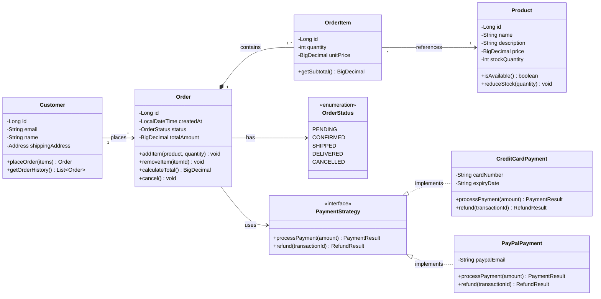
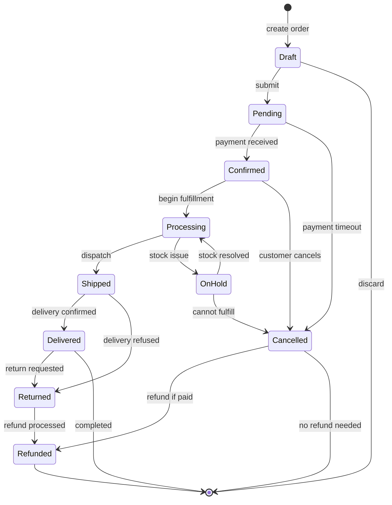
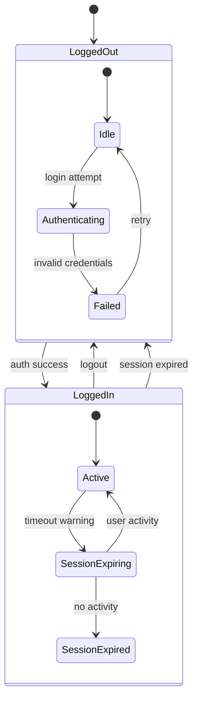
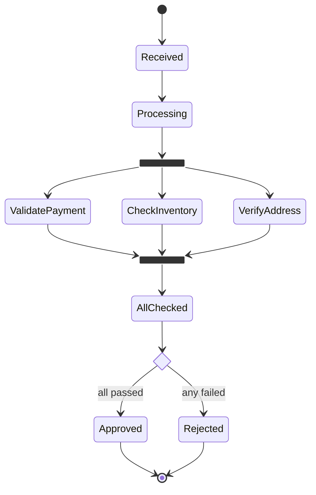
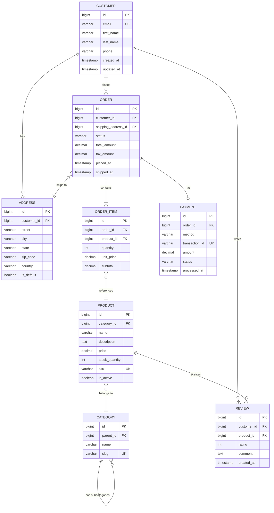

# Structural Diagrams — Class, State & ER Reference

## Table of Contents
1. [Class Diagrams](#class-diagrams)
2. [State Diagrams](#state-diagrams)
3. [ER Diagrams](#er-diagrams)

---

## Class Diagrams

### Anatomy

Class diagrams model object structure: classes, attributes, methods, and relationships.
Always include visibility modifiers and return types for professional quality.

### Visibility modifiers

| Symbol | Meaning |
|--------|---------|
| `+` | Public |
| `-` | Private |
| `#` | Protected |
| `~` | Package / Internal |

### Relationship types

| Relationship | Syntax | Meaning |
|-------------|--------|---------|
| Inheritance | `<\|--` | "is a" (extends) |
| Composition | `*--` | "has a" (strong ownership, lifecycle bound) |
| Aggregation | `o--` | "has a" (weak ownership, independent lifecycle) |
| Association | `-->` | "uses" / "knows about" |
| Dependency | `..>` | "depends on" (transient) |
| Realization | `..\|>` | "implements" (interface) |

### Complete Example: E-Commerce Domain Model



### Class Diagram Best Practices

- Use `direction LR` for wide hierarchies, default `TB` for deep inheritance trees
- Include cardinality on ALL associations: `"1" --> "*"`, `"0..1" --> "1..*"`
- Use `<<interface>>`, `<<abstract>>`, `<<enumeration>>` annotations
- Generics use tildes: `List~Order~`, `Map~String, Object~`
- Group related classes with `namespace` blocks
- Methods should include parameter types and return types
- Keep to 8–10 classes maximum per diagram; split large models

---

## State Diagrams

### Use `stateDiagram-v2`

Always use `stateDiagram-v2` (the newer renderer with better features). The original
`stateDiagram` is legacy and should not be used.

### Core syntax

```
[*] --> State1            %% Start state
State1 --> State2 : event %% Transition with trigger
State2 --> [*]            %% End state
```

### Complete Example: Order Lifecycle



### Composite (Nested) States



### Choice, Fork, and Join



### State Diagram Best Practices

- Always include `[*]` start state and at least one `[*]` end state
- Label EVERY transition with its trigger event
- Use composite states when state count exceeds 15
- `classDef` cannot be applied to `[*]` or composite states (known limitation)
- Concurrent regions use `--` separator inside a state
- Keep nesting to 2 levels maximum

---

## ER Diagrams

### Crow's Foot Notation

ER diagrams use Crow's Foot notation for cardinality:

| Notation | Meaning |
|----------|---------|
| `\|\|` | Exactly one |
| `o\|` | Zero or one |
| `\|{` or `}\|` | One or more |
| `o{` or `}o` | Zero or more |

Line types:
- `--` solid line = identifying relationship (child depends on parent for identity)
- `..` dashed line = non-identifying relationship

### Syntax pattern

```
ENTITY1 ||--o{ ENTITY2 : "relationship verb"
```

Read as: "one ENTITY1 is associated with zero or more ENTITY2"

### Complete Example: E-Commerce Database Schema



### ER Diagram Best Practices

- Use **singular nouns** for entity names: CUSTOMER not CUSTOMERS
- **CAPITALIZE** entity names by convention
- Mark keys explicitly: `PK` (primary), `FK` (foreign), `UK` (unique)
- Include data types for all attributes: `varchar`, `bigint`, `decimal`, `timestamp`, etc.
- Use identifying relationships (`--`) when the child's identity depends on the parent
- Use non-identifying relationships (`..`) when the child can exist independently
- Relationship labels should be verbs: "places", "contains", "has", "writes"
- Keep to 10–15 entities max per diagram; split large schemas by domain boundary
