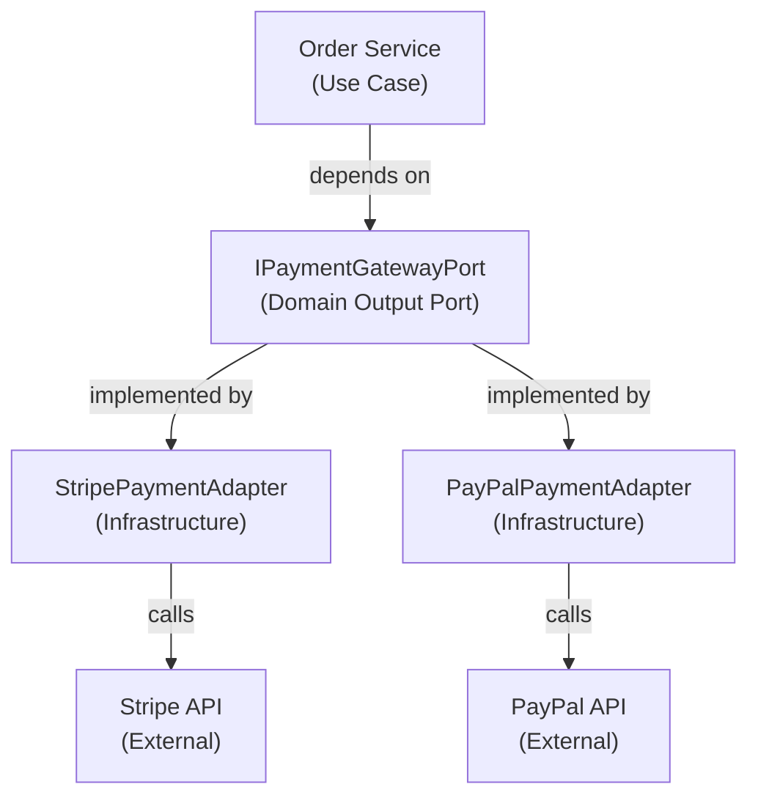
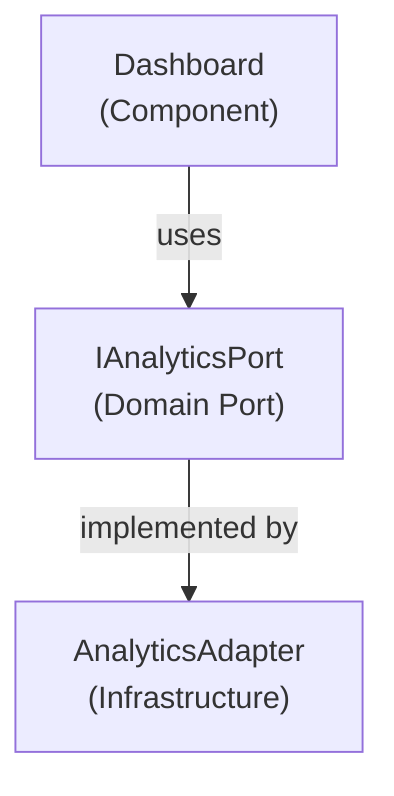

## When to Use

Use this skill when:
- You are about to commit changes and want consistent, automatable history
- You are opening a PR and need a clear, reviewable narrative
- You changed architecture boundaries and must document it with C4 diagrams
- You want commits that tell a story about business intent and technical decisions
- You need to generate changelogs or enable semantic versioning automatically
- Working in teams where code review and history clarity matter

---

## Critical Patterns

### Pattern 1: Conventional Commits Format (REQUIRED)

```
<type>(optional-scope): <description>

<optional body>

<optional footer>
```

**Type**: `feat`, `fix`, `docs`, `refactor`, `test`, `chore`, `style`, `perf`

```bash
# ✅ CORRECT: Clear business intent + scope (business or technical boundary)
feat(payment): add support for PayPal payment processing
fix(order): prevent duplicate order completion
refactor(persistence): extract JPA adapter implementation
test(domain): add unit tests for Money value object
docs(architecture): document Hexagonal Architecture pattern
perf(cache): optimize order lookup with Redis caching

# ❌ WRONG: Vague commits (impossible to search/understand)
fixed stuff
updated code
wip (work in progress)
big refactor
changes
etc...
```

**Why?** Conventional Commits enable:
- **Automated Changelogs**: Parse commits to generate CHANGELOG.md
- **Semantic Versioning**: feat → minor, fix → patch, ! → major
- **Code History Clarity**: git log is readable and searchable
- **CI/CD Automation**: Tools like semantic-release auto-bump versions

### Pattern 2: Scope Reflects Business or Technical Boundary (Clear Intent)

```bash
# ✅ Business domain scopes (what changed in domain)
feat(orders): implement order cancellation
feat(payments): add payment retry logic
feat(users): implement user authentication
fix(orders): handle edge case with negative quantities
perf(orders): optimize order list query

# ✅ Technical scopes (infrastructure/architecture layer changes)
refactor(infrastructure): separate JPA persistence adapter
test(domain): add comprehensive order use case tests
docs(api): document REST endpoint contracts
chore(dependencies): upgrade Spring Boot to 3.3.0
style(code): enforce formatting standards

# ❌ Generic scopes (impossible to understand intent)
feat(app): add new feature  # What feature? In what domain?
fix(code): fix bug          # What bug? Where?
refactor(utils): refactor something  # What utilities? Why?
chore(build): update stuff  # What stuff?
```

**Why?** Scope communicates what part of system changed:
- **Searchability**: Find all payment features: `git log --grep="^feat(payment)"`
- **Domain Organization**: Changes grouped by business domain
- **Intent Communication**: Scope tells what team/domain touched this
- **Atomic Commits**: One scope = one logical change

### Pattern 3: PR Description with Architecture Context (If Changed)

```markdown
## Description

Implement payment provider abstraction to support multiple payment gateways (Stripe, PayPal).

## Type of Change
- [x] Refactor (no business logic change)
- [ ] Feature (new functionality)
- [ ] Bug fix

## Architecture Changes (C4 Diagram)

If this PR modifies architecture boundaries, include context diagram:



## Testing

- [ ] Unit tests added for domain logic
- [ ] Integration tests pass
- [ ] No framework in domain layer
- [ ] Mocks verify port contracts

## Checklist

- [ ] Code follows project conventions
- [ ] Commits use Conventional Commits format
- [ ] No breaking changes to domain contracts
- [ ] Architecture boundaries respected
- [ ] Scope reflects business/technical domain
```

**Why?** PR descriptions with diagrams:
- **Review Clarity**: Reviewers understand architectural intent
- **Decision Documentation**: Future maintainers understand WHY
- **Boundaries Explicit**: C4 diagrams show layer separation
- **Port Contracts**: Verify domain remains framework-agnostic

---

## Decision Tree

```
What are you committing?

New business functionality (feature)?
├── YES → feat(scope): description

Fixed a bug (incorrect behavior)?
├── YES → fix(scope): description

Refactored code (no behavior change)?
├── YES → refactor(scope): description

Added/modified tests?
├── YES → test(scope): description

Updated documentation?
├── YES → docs(scope): description

Updated dependencies/build?
├── YES → chore(scope): description

Otherwise → Reconsider if this should be a commit
```

---

## Code Examples

### Example 1: Feature Commit (Business Intent)

```bash
# Command: Clear business intent, why, what changed
git commit -m "feat(payments): implement multi-gateway payment abstraction

- Create IPaymentGatewayPort interface in domain.spi
- Implement StripePaymentAdapter in adapters.payment
- Implement PayPalPaymentAdapter in adapters.payment
- Wire adapters via @Configuration in infrastructure.config
- Add comprehensive unit tests for both adapters
- Update CompleteOrderUseCase to use payment port

This enables easy swapping between payment providers
without modifying domain logic or business rules.
Domain zero framework dependencies.
Closes #123"

# Result in git log
* feat(payments): implement multi-gateway payment abstraction
  Author: Developer <dev@example.com>
```

### Example 2: Architecture Refactor Commit

```bash
# Command: Clear technical boundaries, layer changes
git commit -m "refactor(architecture): extract JPA persistence adapter

- Move @Entity mapping to infrastructure layer (OrderJpaEntity)
- Create OrderJpaPersistenceAdapter implementing IOrderPersistencePort
- Move Order to pure POJO in domain.model (zero annotations)
- Create OrderJpaMapper translating Entity ↔ Domain Model
- Remove Spring/JPA dependencies from domain layer
- Add integration tests for adapter contract

Fixes framework contamination in domain layer.
Enables database technology swapping (JPA → MongoDB).
Aligns with Hexagonal Architecture principles."

# Result in git log
* refactor(architecture): extract JPA persistence adapter
```

### Example 3: Test Coverage Commit

```bash
# Command: Complete test coverage with Arrange-Act-Assert
git commit -m "test(domain): add comprehensive order use case tests

- Test successful payment processing flow
- Test payment retry on failure (3 max retries)
- Test order persistence after payment
- Test notification sending to customer
- Test edge case with zero items
- 100% coverage of CompleteOrderUseCase

Domain logic now fully tested without Spring framework.
Execution time < 50ms (no database, pure unit tests)."

# Result in git log
* test(domain): add comprehensive order use case tests
```

---

## PR Template

Create `.github/pull_request_template.md`:

```markdown
## What

Brief, clear description of what this PR does (one sentence).

## Why

Why this change? What problem does it solve?
Link to issue: Fixes #123

## Architecture Impact

- [ ] No architecture changes
- [ ] Adds new layer
- [ ] Modifies existing boundary
- [ ] Introduces new port/adapter
- [ ] Changes dependency direction

**If architecture changed, include C4 context diagram:**

\`\`\`mermaid
graph TD
    A["Component A"]
    B["Component B"]
    Port["Port Interface"]
    
    A -->|depends on| Port
    Port -->|implemented by| B
\`\`\`

## Testing

- [ ] Unit tests added (domain logic, no Spring)
- [ ] Integration tests pass
- [ ] No regressions detected
- [ ] Port contracts verified

## Commits

All commits follow Conventional Commits:
- [ ] \`feat(scope): description\` for features
- [ ] \`fix(scope): description\` for bug fixes
- [ ] \`refactor(scope): description\` for refactors
- [ ] \`test(scope): description\` for tests
- [ ] Commits are atomic (one logical change per commit)
- [ ] Commit messages explain WHY, not WHAT (what is in diff)

## Checklist

- [ ] Code follows style guide
- [ ] Documentation updated
- [ ] No breaking changes
- [ ] Architecture boundaries intact
- [ ] Domain layer zero framework annotations
```

---

## gh CLI Commands

### Basic PR Creation

```bash
gh pr create \
  --title "feat(auth): add OAuth2 login" \
  --body "## Summary
- Add Google OAuth2 authentication

## Changes
- Added AuthProvider component
- Created useAuth hook

Closes #42"
```

### PR with HEREDOC (Complex Descriptions)

```bash
gh pr create --title "feat(dashboard): add analytics" --body "$(cat <<'EOF'
## Summary
- Add real-time analytics dashboard

## Changes
- Created AnalyticsProvider
- Added LineChart, BarChart components

## Architecture Impact


## Testing
- [x] Unit tests for components
- [x] Manual testing complete

Closes #123
EOF
)"
```

### Draft PR (Work in Progress)

```bash
gh pr create --draft \
  --title "wip: refactor auth module" \
  --body "Work in progress - not ready for review"
```

### PR with Reviewers and Labels

```bash
gh pr create \
  --title "feat(api): add rate limiting" \
  --body "Adds rate limiting to API endpoints" \
  --reviewer "user1,user2" \
  --label "enhancement,api"
```

---

## Quick Reference

| Task | Command |
|------|---------|
| Create PR | `gh pr create -t "type(scope): desc" -b "body"` |
| Draft PR | `gh pr create --draft` |
| Web editor | `gh pr create --web` |
| Add reviewer | `--reviewer user1,user2` |
| Add label | `--label bug,high-priority` |
| Link issue | `Closes #123` in body |
| View status | `gh pr status` |
| View diff | `gh pr diff` |
| Check CI | `gh pr checks` |
| Merge squash | `gh pr merge --squash` |
| Edit PR | `gh pr edit --add-reviewer username` |

---

## Anti-Patterns

### Vague PR Titles

```bash
# Bad - impossible to understand intent
gh pr create --title "fix bug"
gh pr create --title "update"
gh pr create --title "changes"

# Good - clear conventional commit format
gh pr create --title "fix(auth): prevent session timeout on idle"
gh pr create --title "feat(payment): add PayPal integration"
```

### Giant PRs

```bash
# Bad: 50 files, 2000+ lines in one PR
# - Hard to review
# - High risk of bugs slipping through
# - Merge conflicts nightmare

# Good: Split into logical PRs
# PR 1: feat(models): add User domain model
# PR 2: feat(api): add user REST endpoints
# PR 3: feat(ui): add user management pages
```

### Empty or Vague Descriptions

```bash
# Bad
--body "Added feature"
--body "Fixed it"
--body ""

# Good
--body "## Summary
- Implement PayPal payment gateway adapter

## Changes
- Created IPaymentGatewayPort interface
- Implemented PayPalAdapter in infrastructure
- Added unit tests for adapter

## Architecture Impact
- New adapter follows existing port contract
- No domain changes required

Closes #456"
```

---

## Commands

```bash
# Create commit with conventional format (structured)
git commit -m "feat(scope): brief description

Detailed explanation here (why this change).
- Point 1 (what was changed)
- Point 2 (technical impact)

Closes #123"

# View conventional commits in history (clean, scannable)
git log --oneline  # Shows clear, indexed history

# Interactive conventional commits tool (recommended)
npm install commitizen -g  # Global install
git cz commit  # Interactive prompt (never format wrong again!)

# Setup commitizen for project
npm install --save-dev commitizen cz-conventional-changelog
npx commitizen init cz-conventional-changelog

# Verify commits follow format (pre-commit hook)
npm install --save-dev @commitlint/cli @commitlint/config-conventional

# Create .commitlintrc.json
cat > .commitlintrc.json << 'EOF'
{
  "extends": ["@commitlint/config-conventional"]
}
EOF

# Create .husky pre-commit hook
npx husky install
npx husky add .husky/commit-msg 'npx --no -- commitlint --edit "$1"'

# Generate changelog automatically
npm install --save-dev semantic-release
# Reads commits, auto-bumps version, creates CHANGELOG

# View commits by type (search/analyze history)
git log --grep="^feat" --oneline    # All features (minor versions)
git log --grep="^fix" --oneline     # All fixes (patch versions)
git log --grep="^refactor" --oneline # All refactors (documentation)
git log --grep="^test" --oneline    # All test additions
```

---

## Industry Best Practices (Research-Based)

### Conventional Commits Standard Adoption
**Source: Conventional Commits official site, GitHub ecosystem**

- **Industry Adoption**: Used by Linux kernel, Google projects, Microsoft, React, Angular
- **Automation Ready**: Tools (semantic-release, commitizen) parse commits automatically
- **Changelog Generation**: Commits → CHANGELOG.md (no manual updates!)
- **Version Bumping**: feat → MINOR, fix → PATCH, BREAKING CHANGE → MAJOR

### Scope Best Practices
**Source: Conventional Commits documentation, Angular commit guidelines**

**Choose Scope by:**
- **Business Domain**: payment, orders, users, inventory
- **Technical Layer**: infrastructure, persistence, api, config
- **Subdomain**: core/api, adapters/payment, domain/model
- **One Scope Per Commit**: Encourages atomic commits, easier to revert

### Atomic Commits Principles
**Source: Git best practices, kernel development**

```bash
# ✅ Atomic commit: One logical change
git commit -m "feat(payment): add Stripe adapter"
# Changes: 1 interface (port), 1 adapter, 1 mapper, tests

# ❌ Non-atomic: Multiple unrelated changes
git commit -m "feat(payment): add Stripe + refactor utils + update docs"
# Mix of payment feature, refactoring, documentation - harder to review
```

**Benefits:**
- Easy to review (one intent per commit)
- Easy to revert (undo one logical change)
- Clean git blame (understand why each line exists)
- Rebase-friendly (cherry-pick commits across branches)

### C4 Model Levels
**Source: C4 Model official documentation, architecture diagramming**

- **Level 1 (Context)**: System + external systems it interacts with
- **Level 2 (Container)**: Major components (frontend, backend, database)
- **Level 3 (Component)**: Internal architecture (ports, adapters, layers)
- **Level 4 (Code)**: Class diagrams, code structure (usually auto-generated)

```mermaid
## Level 1: Context (what system does)
graph TD
    User["User<br/>(Person)"]
    OrderSystem["Order System<br/>(Software System)"]
    PaymentAPI["Payment API<br/>(External System)"]
    User -->|places orders| OrderSystem
    OrderSystem -->|calls| PaymentAPI

## Level 2: Container (how system is organized)
graph TD
    Web["Web App<br/>(Container: React)"]
    API["API<br/>(Container: Spring Boot)"]
    DB["Database<br/>(Container: PostgreSQL)"]
    Web -->|calls| API
    API -->|reads/writes| DB

## Level 3: Component (internal architecture)
graph TD
    Controller["Order Controller<br/>(REST input)"]
    UseCase["Order Use Case<br/>(Domain logic)"]
    Adapter["Payment Adapter<br/>(Infrastructure)"]
    Controller -->|calls| UseCase
    UseCase -->|calls| Adapter
```

### Tools for C4 Diagrams
**Source: C4 Model tooling research, architecture documentation**

- **PlantUML**: Code-based, version-controllable, easy diffs, GitHub native
- **draw.io**: Visual editor, integrates with Confluence, cloud storage
- **Mermaid**: JavaScript, GitHub native, simple syntax
- **Structurizr**: Dedicated C4 tool with code generation

```plantuml
' PlantUML C4 example (code-based, version-controllable)
!include https://raw.githubusercontent.com/plantuml-stdlib/C4-PlantUML/master/C4_Context.puml

Person(customer, "Customer", "Orders products")
System(order_system, "Order System", "Manages orders")
System(payment_api, "Payment API", "Processes payments")

Rel(customer, order_system, "uses")
Rel(order_system, payment_api, "calls")
```

### Semantic Versioning from Commits
**Source: Semantic Release documentation, semver.org**

```
MAJOR.MINOR.PATCH

feat: → MINOR version bump (1.0.0 → 1.1.0)
fix:  → PATCH version bump (1.0.0 → 1.0.1)
feat! or BREAKING CHANGE: → MAJOR version bump (1.0.0 → 2.0.0)
```

```bash
# Example: Automatic versioning from commits
# Commits since last release:
feat(payment): add PayPal support         # → MINOR
fix(order): handle edge case              # → PATCH
refactor(api): clean up controller        # → (no version change)

# Result: 1.2.3 → 1.3.0 (bumped MINOR for new feature)
# Changelog generated automatically from feat/fix commits
# Git tag created automatically: v1.3.0
```

### Commitizen + Semantic-Release Workflow
**Source: Commitizen docs, semantic-release docs**

```bash
# Interactive conventional commits (never format wrong)
npm install -g commitizen cz-conventional-changelog
git cz commit  # Interactive prompt

# Auto-changelog, auto-versioning, auto-release
npm install --save-dev semantic-release
# Reads commits after each push → auto-bumps version → creates CHANGELOG → publishes release

# Full workflow:
# 1. git cz commit (interactive conventional commit)
# 2. git push
# 3. semantic-release (auto-analyzes, bumps version, creates release)
```

---

## Best Practices Summary

### Commit Message Structure
- ✅ Type (feat, fix, refactor, test, docs, chore)
- ✅ Scope (business domain or technical boundary)
- ✅ Description (imperative mood, < 50 chars)
- ✅ Body (explain WHY not WHAT)
- ✅ Footer (issue references, breaking changes)
- ❌ NO emojis in commits (automation-unfriendly, breaks parsing)
- ❌ NO vague messages (must be searchable)

### PR Title and Description
- ✅ PR title follows conventional commit format
- ✅ Clear Summary section (WHAT and WHY)
- ✅ Changes section (main modifications)
- ✅ Testing checklist
- ✅ Link to issue (Closes #123)
- ❌ NO emojis in PR titles or descriptions (keep it professional)
- ❌ NO giant PRs (split into logical, reviewable chunks)
- ❌ NO empty descriptions (always explain intent)

### Scope Rules
- ✅ Reflects business domain or technical layer
- ✅ One scope per commit (atomic)
- ✅ Consistent naming across project
- ❌ NOT generic (app, code, stuff)
- ❌ NOT too specific (file names)

### Atomic Commits
- ✅ One logical change per commit
- ✅ Easy to review (one intent)
- ✅ Easy to revert (undo one change)
- ✅ Clean history (no accidental mixing)
- ❌ NEVER mix feature + refactor + docs

### PR Documentation
- ✅ C4 diagram if architecture changed
- ✅ Link to issue (Closes #123)
- ✅ Testing checklist
- ✅ Architecture impact statement
- ❌ NO implementation details (they're in diff)

---

## Resources

- **Conventional Commits**: https://www.conventionalcommits.org/
- **C4 Model**: https://c4model.com/ (Context, Container, Component, Code)
- **PlantUML**: https://plantuml.com/c4-diagram (code-based diagrams)
- **Commitizen**: https://github.com/commitizen/cz-cli (interactive commits)
- **Semantic Release**: https://semantic-release.gitbook.io/ (auto-versioning)
- **draw.io**: https://draw.io (visual C4 diagrams)

## Keywords

git, conventional commits, commits, PR, pull request, changelog, semantic versioning, C4 diagram, architecture documentation, commitizen, semantic-release
